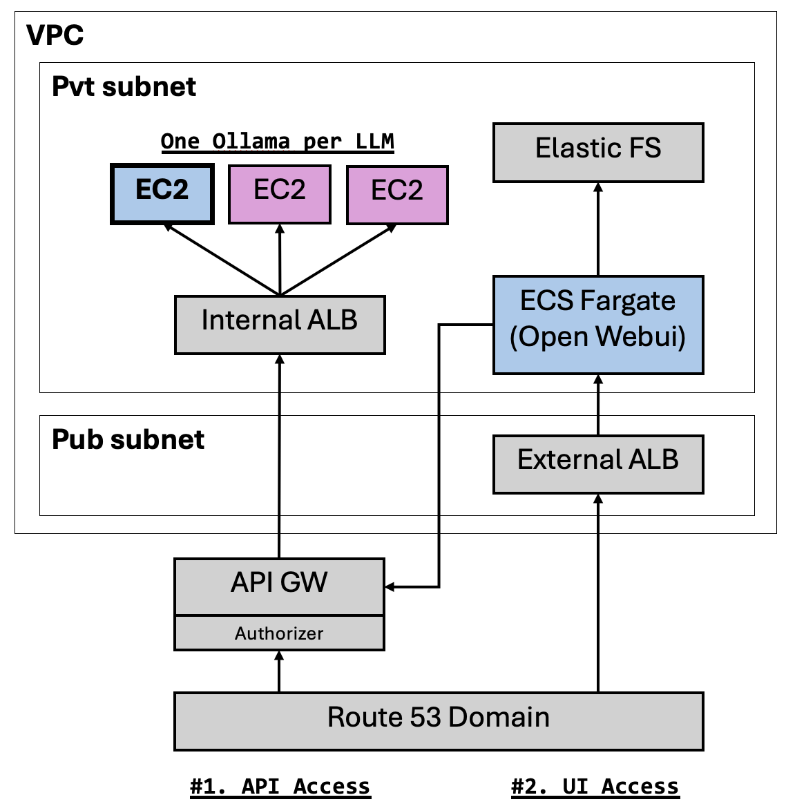

# Terraform to Setup an Ollama + Open WebUI Deployment

This TF repo setup a ready-to-use **Ollama** service, together with its front end **Open WebUI** service.

These two are separate child TF modules, which can be used independently. Please refer to below for more details.

1. [TF for ollama-service](./modules/ollama-service-multi-servers/README.md): deploys Ollama via EC2s and exposes over API Gateway

2. [TF for open-webui-service](./modules/open-webui-service/README.md): deploys Open WebUI via ECS Fargate

For usage and features of **Ollama** and **Open WebUI**, please refer to the official documentation below

1. [Ollama Documentation](https://github.com/ollama/ollama/blob/main/docs/api.md) for details about its API usage

2. [Open WebUI documentation](https://github.com/open-webui/open-webui/blob/main/README.md) for details about its usage

## Architecture



## How to Use

```terraform
module "ollama_and_open_webui" {
    region                    = "ap-southeast-1"
    azs                       = ["ap-southeast-1a", "ap-southeast-1b"]
    vpc_private_subnets_cidrs = ["172.31.48.0/20", "172.31.64.0/20"]
    vpc_private_subnets_names = ["private-48-1a", "private-64-1b"]
    vpc_public_subnets_cidrs  = ["172.31.0.0/20", "172.31.16.0/20"]
    vpc_public_subnets_names  = ["public-0-1a", "public-16-1b"]

    llm_ec2_configs = [
        {
            llm_model     = "llama3:8b"
            instance_type = "g5g.xlarge"
            ami_id        = ""
            ebs_volume_gb = 200
            app_port      = 11434
        },
        {
            llm_model     = "qwen2:7b"
            instance_type = "g5g.xlarge"
            ami_id        = ""
            ebs_volume_gb = 200
            app_port      = 11434
        },
    ]

    create_api_gw                = true
    disable_execute_api_endpoint = true
    api_gw_domain                = "xx.xxx.com"
    api_gw_domain_route53_zone   = "xxxxx"
    api_gw_domain_ssl_cert_arn   = "arn:aws:acm:ap-southeast-1:xxxx:certificate/xxxxx"

    open_webui_task_cpu            = 1024
    open_webui_task_mem            = 2048
    open_webui_task_count          = 2
    open_webui_port                = 8080
    open_webui_image_url           = "xxxx.dkr.ecr.ap-southeast-1.amazonaws.com/open-webui:v0.3.4"
    open_webui_domain              = "yy.yyyy.com"
    open_webui_domain_route53_zone = "xxxxxx"
    open_webui_domain_ssl_cert_arn = "arn:aws:acm:ap-southeast-1:xxxx:certificate/xxxxx"
}
```

### Notes

1. For Ollama, after TF apply finish, please check all AWS SSM Run Command `xxx-pull-models` run to completion with success.
2. For Open WebUI portal, after setup, please Sign up on the portal and continue use from there

## Infra setup includes

- A VPC

  - private subnets & public subnets
  - NAT Gateway and Internet GW
  - necessary VPC endpoints, route tables, nacl, default sg

- Ollama running on a list of EC2

- Open WebUI running on an ECS Cluster and Service

## Output

- URL to access Ollama service

  - `llm_service_endpoint`

- URL to access Open WebUI

  - `open_webui_endpoint`
