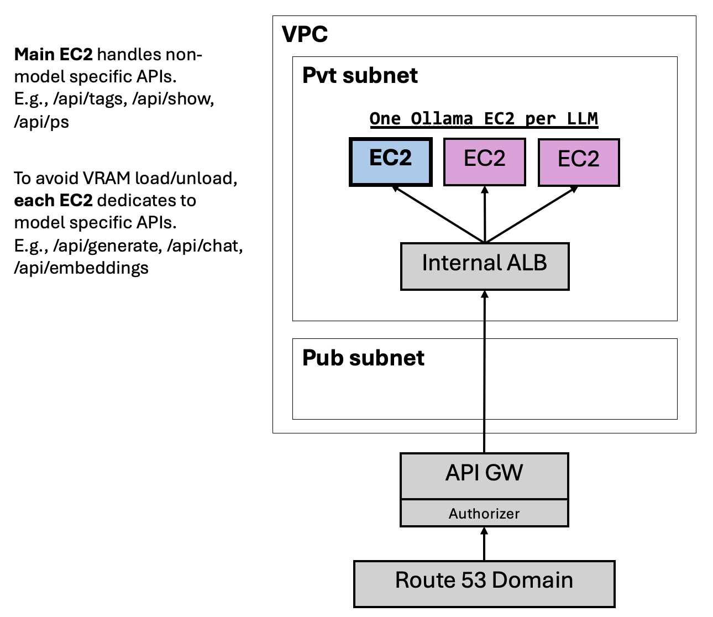

# Terraform to Setup of Ollama on AWS EC2

## Architecture



## Usage

```terraform
module "llm_service" {
  source = "./modules/ollama-service-multi-servers"

  azs = var.azs

  vpc_id         = "vpc-xxxxxx"
  vpc_cidr_block = "172.31.0.0/16"
  subnet_ids = ["subnet-1111", "subnet-2222"]

  llm_ec2_configs = [
    {
      llm_model     = "llama3:8b"
      instance_type = "g5g.xlarge"
      ami_id        = ""  # if empty string, fall back to default DL AMI by AWS
      ebs_volume_gb = 200
      app_port      = 11434
    },
    {
      llm_model     = "qwen2:7b"
      instance_type = "g5g.xlarge"
      ami_id        = ""  # if empty string, fall back to default DL AMI by AWS
      ebs_volume_gb = 200
      app_port      = 11434
    }
  ]

  open_webui_port = 8080

  create_api_gw                   = true
  api_gw_disable_execute_endpoint = true
  api_gw_domain                   = "xx.xxx.com"
  api_gw_domain_route53_zone      = "xxxx"
  api_gw_domain_ssl_cert_arn      = "arn:aws:acm:ap-southeast-1:xxx:certificate/xxxxx"
}
```

### Notes

1. User still needs to `ollama pull <model>:<tag>` in respective EC2
   - In the main server, please pull all the models
   - \*this is something to be enhanced
2. Please refer to [Ollama Documentation](https://github.com/ollama/ollama/blob/main/docs/api.md) for details about its API usage
3. EC2 VRAM Spec quick reference:
   - g4dn.xlarge, x86, VRAM=1\*16GB
   - g4dn.12xlarge, x86, VRAM=4\*16GB
   - g5g.xlarge, arm, VRAM=1\*16GB
   - g5g.16xlarge, arm, VRAM=2\*16GB

## Design Consideration: One EC2 per LLM

### Why one EC2 per LLM?

- AWS has limited EC2 types and VRAM sizing that are suitable to run LLM
- Ollama offers convenient way to deploy multiple different LLM models
- However, VRAM size limits the number of LLM that can be loaded into VRAM at the same time. Request to different LLM leads requires model loading/unloading from VRAM, which causes significant delays.
- Hence, the architecture design allows us to deploy a single model per EC2 (instance type may vary) so that the LLM can fully fit into the EC2 VRAM for quick response.

- The design includes additional infra & logic to redirect model-specific API request to respective EC2

  - Generate a completion - `POST /api/generate`
  - Generate a chat completion - `POST /api/chat`
  - Generate Embeddings - `POST /api/embeddings`

### What are the catches?

- Require one of the EC2 to be main, so as to handle non-model-specific API requests. Main server needs to pull all the LLM models, although only one is used for inference.

  - List running model - `GET /api/ps`
  - List Local Models - `GET /api/tags`
  - Show Model Information - `POST /api/show`

- Some API not supported, requires manual administration

  - Create a Model - `POST /api/create`
  - Copy a Model - `POST /api/copy`
  - Delete a Model - `DELETE /api/delete`
  - Pull a Model - `POST /api/pull`
  - Push a Model - `POST /api/push`

## Infra Setup Includes

- List of EC2 (one per LLM)

  - arm/x86 instance with GPU (e.g. `g5g`, `g4dn`) and the corresponding Deep learning AMI
  - hosted in the provided private subnets
  - Ollama installed and exposed over 0.0.0.0:${app_port}
  - GPU monitoring setup to CW custom metrics
  - necessary IAM roles, policy and sg

- An Internal facing ALB

  - hosted in private subnets
  - listener for port 80
  - one target group for each LLM EC2s
  - listener rules to forward model-specific requests to respective target groups (i.e. EC2s)
  - default listener rule to forward non-model-specific requests to the main EC2

- An API GW

  - with vpc links to the VPC hosting llm EC2
  - including an auto-deploy stage
  - (Optional) expose/disable the default api endpoint
  - (Optional) custom domain name setup to replace the API Gw default endpoint
  - based on POST request body, add model info to query string
  - forward POST, GET, DELETE api to the ALB at port 80

## Pre-requisites

- A VPC with private subnets (NAT Gateway needed for outgoing traffic)
- SSL cert and Route53 host zone if need to expose Ollama endpoint

## Output

- Resource created
  - `ec2`
  - `alb`
  - `api_gw`
- URL to access Ollama service
  - `service_endpoint`

## Future enhancement or exploration

1. How to host a larger model in singapore? e.g. 70b. Use instance with multiple GPU? Use other CSP?
2. How to make LLM server more scalable for high number of user requests?
3. Deploy using Vllm VS Ollama
4. How to better manage downloaded model, always download fresh from internet can be slow and expensive?
