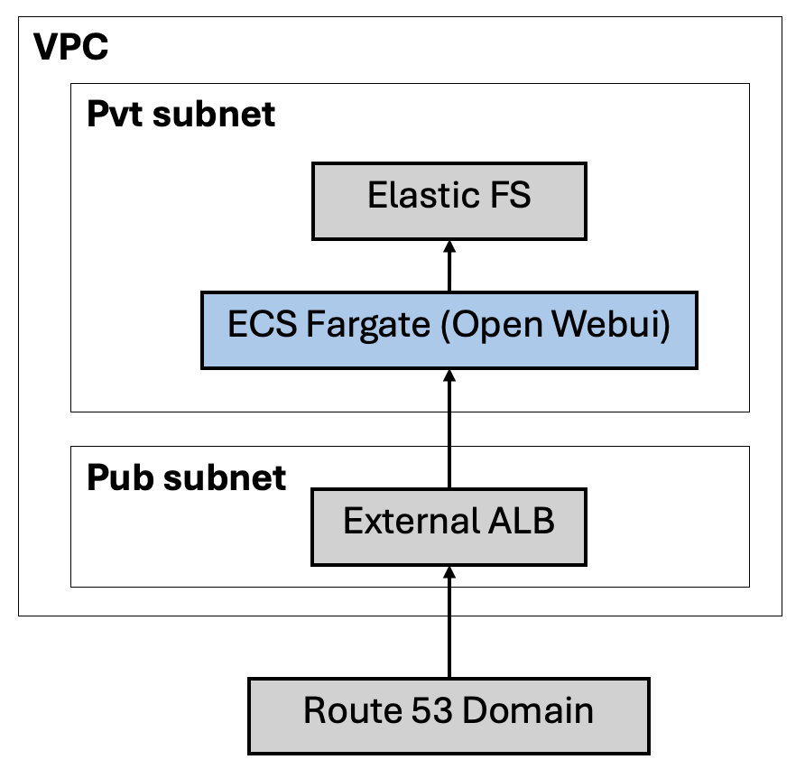

# Terraform to Setup Open WebUI on AWS ECS Fargate

## Architecture



## Usage

```terraform
module "open_webui_service" {
  source = "./modules/open-webui-service"

  region = "ap-southeast-1"
  azs    = ["ap-southeast-1a", "ap-southest-1b"]

  vpc_id         = "vpc-xxxxxx"
  vpc_cidr_block = "172.31.0.0/16"
  ecs_subnet_ids = ["subnet-1111", "subnet-2222"]
  alb_subnet_ids = ["subnet-3333", "subnet-4444"]

  llm_service_endpoint = "https://xx.xxx.com"

  open_webui_task_cpu            = 1024
  open_webui_task_mem            = 2048
  open_webui_task_count          = 3
  open_webui_port                = 8080
  open_webui_image_url           = "xxx.dkr.ecr.ap-southeast-1.amazonaws.com/open-webui:v0.3.4"
  open_webui_domain              = "yy.yyy.com"
  open_webui_domain_route53_zone = "xxxx"
  open_webui_domain_ssl_cert_arn = "arn:aws:acm:ap-southeast-1:xxx:certificate/xxxxx"
}
```

### Notes

1. Please refer to [Open WebUI documentation](https://github.com/open-webui/open-webui/blob/main/README.md) for details about its usage

2. Open WebUI is deployed on pure CPU fargate container workload. Any native inference features should configure to use external models for better performance.

## Infra Setup Includes

- An ECS Cluster and Service

  - an ECS Fargate Cluster in private subnet
  - a service and task def compatible with Open WebUI docker deployment
  - with an EFS as the volume shared by containers
  - necessary IAM role, policy and security groups

- An Internet facing ALB

  - hosted in public subnets across availability zone
  - listener and rules for port 80 or 443 (if SSL supplied)
  - target group for open webui port toward the ECS fargate service
  - (Optional) DNS record exposing ALB over HTTPS, if SSL cert supplied

## Pre-requisites

- A VPC with public, private subnets
- Open WebUI Docker built and pushed to ECR
- An Ollama service endpoint for Open WebUI to connect to
- SSL cert and Route53 host zone if need to expose Open WebUI portal

## Output

- Resource created
  - `ecs_cluster`
  - `ecs_task_def`
  - `ecs_service`
  - `efs`
  - `alb`
- URL to access Open WebUI
  - `service_endpoint`

## Future enhancement or exploration

1. Can Open WebUI access a protected endpoint of Ollama? (e.g. bearer token etc)
